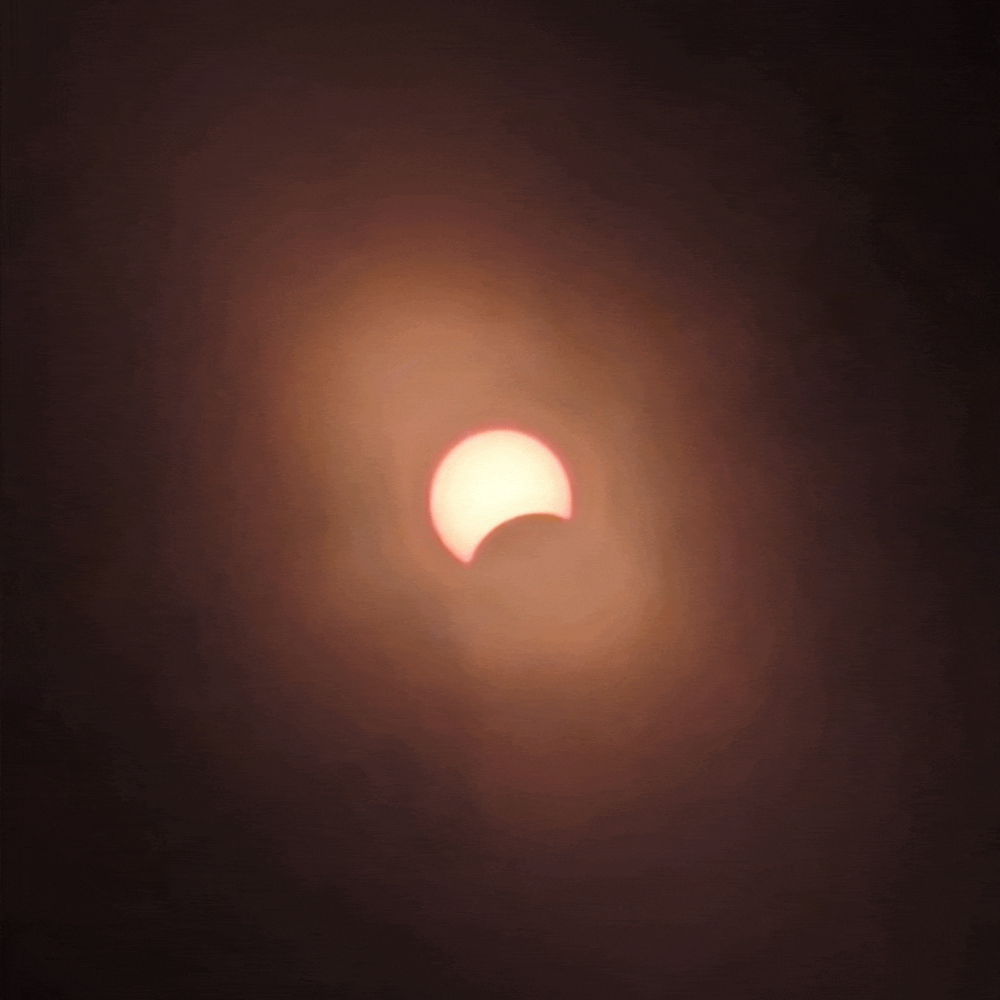

# Solar Eclipse 8 April 2024
In this repository you will find photos in various formats of the solar eclipse that occurred on 8 April 2024. To learn more about the eclipse you can visit the [Wikipedia page](https://en.wikipedia.org/wiki/Solar_eclipse_of_April_8,_2024) or [NASA's website](https://science.nasa.gov/eclipses/future-eclipses/eclipse-2024/). These photos were taken in [Crystal River State Park in Barton, Vermont, USA](https://maps.app.goo.gl/gpSc7hgjMa1ecM2Y6).

## What's where?
You will find three main folders in this repository: `all aligned`, `gifs`, and `tiles`. 

- The `all aligned` folder contains centered and rotated photos that were taken during the eclipse. 
- The `gifs` folder contains different speed and size gifs that were created from the photos in the `all aligned` folder minus a few photos that make the GIF look more jittery which can be found in the `individual photos` subfolder.
- The `tiles` folder contains various combinations of photos stitched together in a grid.

## How were the photos taken?
The photos were taken on a Google Pixel 7 in the stock camera app. I held a set of solar eclipse classes in front of the camera and took the photos every so often. I then aligned and rotated each photo and created GIFs and tiles from them.

## Can I use these photos?
Yes, however, credit would be greatly appreciated if you use them. You can credit me by linking to this repository. Feel free to download, print, edit, and share!

## Photos

